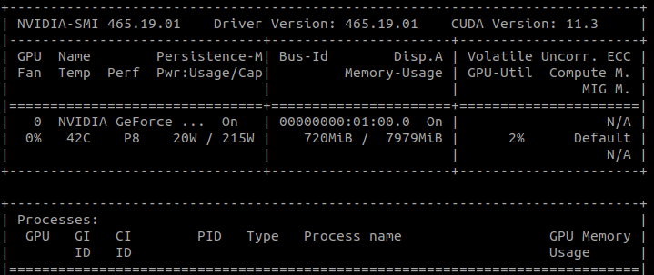

# ASOne

#### Table of Contents
- [Docker Intallation](#docker-installation)
  - [Ubuntu](#ubuntu)
    - [Prerequisite](#prerequisite)
    - [Install Using Shell Script](#install-using-shell-script)
    
# Docker Installation

## Ubuntu
#### Prerequisite
1. For systems with `GPU` please verify you have nvidia drivers installed. run

```
nvidia-smi
```
if you see something like the following. Then you can continue running [shell script](#install-using-shell-script)



 or you can install nvidia drivers using following command:

```
sudo apt-get install nvidia-driver-YYY nvidia-dkms-YYY
```
- `YYY`= Nvidia driver version

e.g `sudo apt-get install nvidia-driver-510 nvidia-dkms-510`

- `Reboot` your system after installing nvidia-drivers.
```
sudo reboot
```

#### Install using Shell Script

```
cd asone-linux
chmod a+x docker-installation.sh
./docker-installation.sh
```
  - For systems with `GPU` run following commands after installing docker.

  Setup the package repository and the GPG key:
  ```
   distribution=$(. /etc/os-release;echo $ID$VERSION_ID) \
      && curl -fsSL https://nvidia.github.io/libnvidia-container/gpgkey | sudo gpg --dearmor -o /usr/share/keyrings/nvidia-container-toolkit-keyring.gpg \
      && curl -s -L https://nvidia.github.io/libnvidia-container/experimental/$distribution/libnvidia-container.list | \
         sed 's#deb https://#deb [signed-by=/usr/share/keyrings/nvidia-container-toolkit-keyring.gpg] https://#g' | \
         sudo tee /etc/apt/sources.list.d/nvidia-container-toolkit.list
  ```
  Install the `nvidia-docker2` package (and dependencies) after updating the package listing:
  ```
  sudo apt-get update
  sudo apt-get install -y nvidia-docker2
  sudo systemctl restart docker

  sudo xhost +local:docker
  ``` 

- [NOTE] If there is an error while installing docker, try removing apt-lists and resinstalling.

```
sudo rm -rf /var/lib/apt/lists/*
./docker-installation.sh
```

```
# jump back to main folder
cd ..
```

If everything is done successfully you can return to [Installation Page](../README.md) 

In case shell script keeps failing or you want to install manually follow steps in [Manual Installation](Instructions/Manual-Installation.md)
